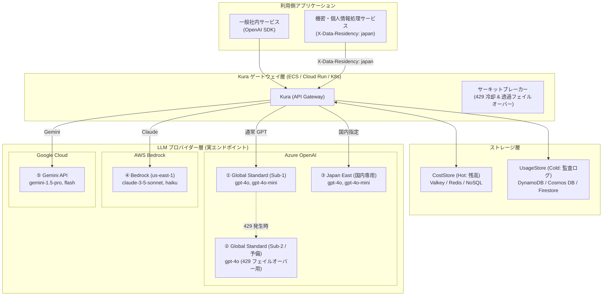

# アーキテクチャ & システム設計仕様書

## 1. システム概要 & アーキテクチャ構成

本システム（**Kura**）は、マルチテナント環境における大規模言語モデル（LLM）へのアクセスを一元管理・中継する超軽量・高パフォーマンスな LLM API ゲートウェイである。
OpenAI 互換のインターフェースを提供し、Microsoft Foundry (旧 Azure AI Foundry / OpenAI)、Google Gemini、Amazon Bedrock 等のマルチプロバイダーへ極低遅延でルーティングする。

Kura は独立した LLM ゲートウェイとして単体で運用できるほか、前段に認証プロキシや API ゲートウェイ（Tollgate, Kong, Envoy, AWS API Gateway 等）を配置して多層防御構成をとることが可能である。

```
                       +-----------------------------+
                       |      Client Application     |
                       +-----------------------------+
                                      |
                                      | HTTP / WebSocket
                                      v
                       +-----------------------------+
                       |   前段認証ゲートウェイ (任意)  |
                       |  (Tollgate / Kong / ALB 等) |
                       |  - エンドユーザー認証 / RPM  |
                       |  - X-Gateway-Secret 付与     |
                       +-----------------------------+
                                      |
                                      v
       +-------------------------------------------------------------+
       |                         Kura                                |
       |  - ゲートウェイ信頼確認 (X-Gateway-Secret 定数時間比較)      |
       |  - テナント解決 (X-Tenant-ID, X-Service-ID) & 認可          |
       |  - 仮想モデルエイリアス解決 (fast, smart, flash 等)         |
       |  - リアルタイム月次予算ガード (ソフトリミット 429 遮断)     |
       |  - 日本データレジデンシールーター (X-Data-Residency: japan) |
       |  - 未知パラメータ透過パススルー (thinking 等)              |
       |  - SSE ストリーミング制御 (X-Accel-Buffering: no)           |
       |  - 非同期構造化ログ (UsageLogEvent) & 分散トレース伝播      |
       +-------------------------------------------------------------+
              |                      |                      |
              v                      v                      v
       +---------------+     +---------------+     +--------------------+
       |  MS Foundry   |     | Google Gemini |     |   Amazon Bedrock   |
       |  (GPT/Claude) |     |  (AI Studio)  |     |  (bedrock-mantle)  |
       +---------------+     +---------------+     +--------------------+
              ^                      ^                      ^
              |                      |                      |
              +----------------------+----------------------+
                                     |
               ┌─────────────────────┴─────────────────────┐
               ▼ (残枠確認・アトミック加算)                  ▼ (利用実績・月次集計・ロック)
     +---------------------------+             +---------------------------+
     |   コスト管理ストア (Hot)   |             |   集計結果ストア (Cold)   |
     | SQLite / DynamoDB / Valkey|             | SQLite / DynamoDB / Postgre|
     +---------------------------+             +---------------------------+
               │                                             │
               └───────────────── 補正 (Reconcile) ──────────┘
```

---

## 2. レイヤー設計 (Standard Go Project Layout)

クリーンアーキテクチャの原則に準拠し、依存関係が内側（ドメイン層）に向かうレイヤード構造を採用している。

```
kura/
├── cmd/
│   ├── server/                     # Gateway 本体エントリーポイント (main.go)
│   └── mock_server/                # ローカル検証用モック LLM サーバー
├── internal/
│   ├── domain/                     # 【ドメイン層】外部依存を持たない純粋な業務ルール・モデル
│   │   ├── entity/                 # Chat, Tenant, Pricing, Usage, Error, Model
│   │   ├── repository/             # CostStore / UsageStore インターフェース
│   │   └── service/                # Adapter, UsageLogger, PricingEngine インターフェース
│   ├── usecase/                    # 【ユースケース層】ドメインを組み合わせた業務シナリオ
│   │   ├── auth_usecase.go         # テナント認証/解決・タグ抽出・クォータ残枠確認
│   │   ├── chat_usecase.go         # 仮想モデル名解決・プロバイダー選択・モデル認可
│   │   ├── admin_usecase.go        # 管理用 API・クォータ設定/利用量取得
│   │   └── batch_usecase.go        # 月次締めレポート・残量低下アラート・残高補正
│   ├── infrastructure/             # 【インフラ層】外部技術・フレームワークの具象実装
│   │   ├── adapter/                # Microsoft Foundry / Bedrock (OpenAI 互換) アダプター
│   │   ├── cache/                  # キャッシュ層デコレーター (ネガティブキャッシュ等)
│   │   ├── config/                 # 環境変数ローダー (config.go)
│   │   ├── cosmosdb/               # Azure Cosmos DB ストア実装 (NoSQL API)
│   │   ├── dynamodb/               # DynamoDB ストア実装 (Single Table Design)
│   │   ├── firestore/              # Google Cloud Firestore ストア実装
│   │   ├── logger/                 # 非同期チャネル構造化コンソールロガー
│   │   ├── metrics/                # Prometheus メトリクスコレクター
│   │   ├── notifier/               # アプリ内通知・ログ出力アダプター
│   │   ├── proxy/                  # LLM リバースプロキシ・SSE・Usage インターセプト
│   │   ├── scheduler/              # 自律 Cron & 補正スケジューラー
│   │   ├── sqlite/                 # SQLite ストア実装 (純 Go / CGO 不要)
│   │   ├── store/                  # ストアファクトリ & 組み合わせ検証
│   │   ├── valkey/                 # Valkey / Redis コストストア実装
│   │   └── websocket/              # Realtime API WebSocket パススルー
│   └── delivery/                   # 【プレゼンテーション層】入出力アダプター
│       └── http/
│           ├── api.go              # Huma v2 OpenAPI 3.1 & Scalar ドキュメント自動生成
│           ├── handler.go          # HTTP ハンドラ (/v1/chat/completions, /v1/realtime, /v1/usage 等)
│           ├── admin_handler.go    # 管理用 API ハンドラ (/v1/admin/*)
│           ├── middleware.go       # ゲートウェイ共有シークレット検証・認証・コンテキスト付与
│           ├── cors.go             # CORS 設定ミドルウェア
│           └── response.go         # レスポンスヘルパー
├── deploy/
│   └── monitoring/                 # Prometheus & Grafana プロビジョニング・ダッシュボード
├── pricing.json                    # モデル別単価表 JSON ファイル
└── docs/                           # 詳細仕様ドキュメント群
```

---

## 3. ルーティング & プロバイダー解決

### 3.1 仮想モデルエイリアス (Model Alias Routing)
クライアント側が特定のベンダー名・モデルバージョンを直接ハードコードせずに利用できるよう、仮想エイリアスによる解決を提供する。

| 仮想エイリアス | 解決先モデル名 | ターゲットプロバイダー | 主な用途 |
|---|---|---|---|
| `fast`, `default` | `gpt-5.4-mini` | Microsoft Foundry | 高速応答、低レイテンシ、低コストタスク |
| `smart`, `code` | `claude-3-5-sonnet`| Microsoft Foundry | 高度な推論、コーディング、複雑な指示追従 |
| `flash` | `gemini-1.5-flash` | Google Gemini | 大規模コンテキスト、マルチモーダル、超高速処理 |

※ クライアントが実モデル名（例: `gpt-4o`, `anthropic.claude-3-5-sonnet-20240620-v1:0` 等）を直接指定した場合は、エイリアス変換を行わずそのまま各プロバイダーにルーティングされる。

### 3.2 日本データレジデンシー仕様 (Japan Data Residency)
クライアントが `X-Data-Residency: japan` ヘッダーを付与した場合、Microsoft Foundry へのリクエストは自動的に東日本リージョン等の国内限定エンドポイント（環境変数 `MICROSOFT_FOUNDRY_ENDPOINT_JAPAN`）へルーティングされる。未指定時はグローバルエンドポイント（`MICROSOFT_FOUNDRY_ENDPOINT`）が使用される。

### 3.3 未知パラメータの透過 (FR-06)
各ベンダーの新機能パラメータ（例: OpenAI の `thinking: { type: "enabled", budget_tokens: 1024 }` や Anthropic の独自フィールド等）を受信した場合、Gateway は構造体定義外のキーを `ExtraFields` として保持し、プロバイダー向けリクエスト JSON へ無変換で復元・透過する。

---

## 4. ストアアーキテクチャ & キャッシュ層

### 4.1 コスト管理ストア (CostStore) と 集計結果ストア (UsageStore) の分離
- **CostStore（ホットパス）**: 高速な残枠確認（ソフトリミット）とアトミックなコスト加算に特化（SQLite, DynamoDB, Cosmos DB, Firestore, Valkey/Redis）。
- **UsageStore（永続・集計）**: 時系列の利用実績記録、月次レポート集計、分散ロック、通知永続化を担当（SQLite, DynamoDB, Cosmos DB, Firestore）。

### 4.2 キャッシュ層（デコレーター）
マルチコンテナ運用時、Hot パスにおけるストアへの負荷を最小化するため、キャッシュデコレーターを内包している：
1. **ネガティブキャッシュ**: 予算超過判定されたテナントをローカルメモリに記録し、以降のリクエストをストアアクセスなしで即時 429 拒絶。
2. **設定キャッシュ**: テナントの予算額・プラン設定をローカルキャッシュ（既定 TTL: 60 秒）。
3. **残枠・バッチ加算キャッシュ**: オプションで残枠読み取りキャッシュおよび加算のバッファリングを提供。

---

## 5. パフォーマンス & メモリアロケーション検証 (ベンチマーク)

Kura では、大量のリクエストおよび長時間の SSE ストリーミング中継において Go ランタイムの GC（ガベージコレクション）負荷を最小限に抑えるため、ホットパスにおけるゼロアロケーション（Zero Allocation）および省メモリ設計を徹底している。

### ベンチマーク実行方法
```bash
# 全ホットパスのベンチマーク実行
go test -bench=. -benchmem -run=^# ./internal/...
```

---

## 6. 推奨構築構成 (Recommended Architectures)

本番・社内共通基盤として Kura を運用する際の推奨構成モデル。



### 6.1 LLM エンドポイント構成（プロバイダー層）

| No | 用途 | プロバイダー / リージョン | 担当モデル | 役割・特徴 |
| :---: | :--- | :--- | :--- | :--- |
| **1** | **GPT 主系** | Azure OpenAI (Global Standard - Sub A) | `gpt-4o`, `gpt-4o-mini` | 平時の大半のトラフィックを処理 |
| **2** | **GPT 副系** | Azure OpenAI (Global Standard - Sub B) | `gpt-4o` | 主系が 429 になった時の**自動フェイルオーバー先** |
| **3** | **国内専用** | Azure OpenAI (Japan East) | `gpt-4o`, `gpt-4o-mini` | `X-Data-Residency: japan` 指定時のみ使用 |
| **4** | **Claude 系** | AWS Bedrock (`us-east-1` または `ap-northeast-1`) | `claude-3-5-sonnet`, `haiku` | 高度なコーディング・長文解析 |
| **5** | **Gemini 系** | Google Gemini (Official) | `gemini-1.5-flash`, `pro` | 超高速・マルチモーダル・低コスト |

### 6.2 ストレージ選定方針

- **小規模・PoC（単一コンテナ運用）**:
  - `COST_STORE=sqlite` / `USAGE_STORE=sqlite`（追加インフラ不要）
- **AWS 本番環境（マルチコンテナ・水平スケール）**:
  - `COST_STORE=valkey`（ElastiCache for Valkey / Redis） + `USAGE_STORE=dynamodb`
- **Azure 本番環境（マルチコンテナ・水平スケール）**:
  - `COST_STORE=cosmosdb` + `USAGE_STORE=cosmosdb`
- **Google Cloud 本番環境（マルチコンテナ・水平スケール）**:
  - `COST_STORE=firestore` + `USAGE_STORE=firestore`

